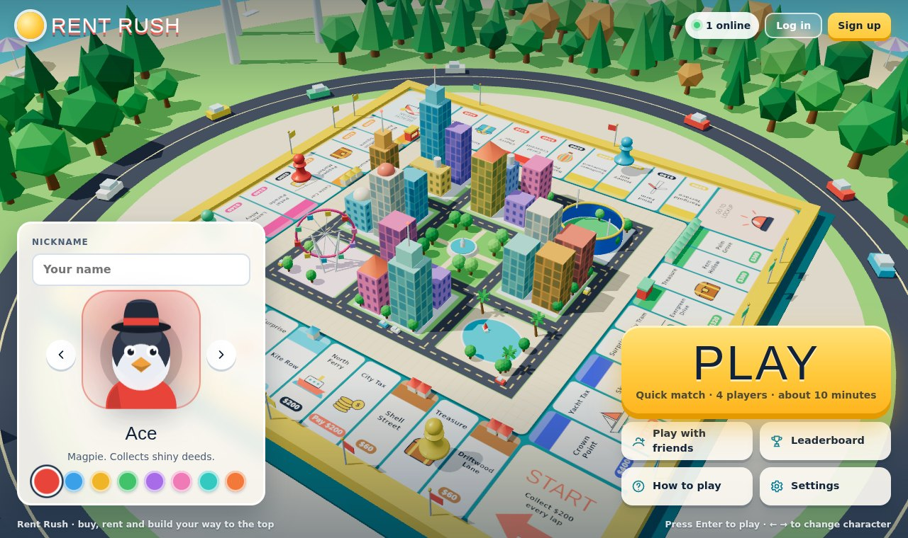
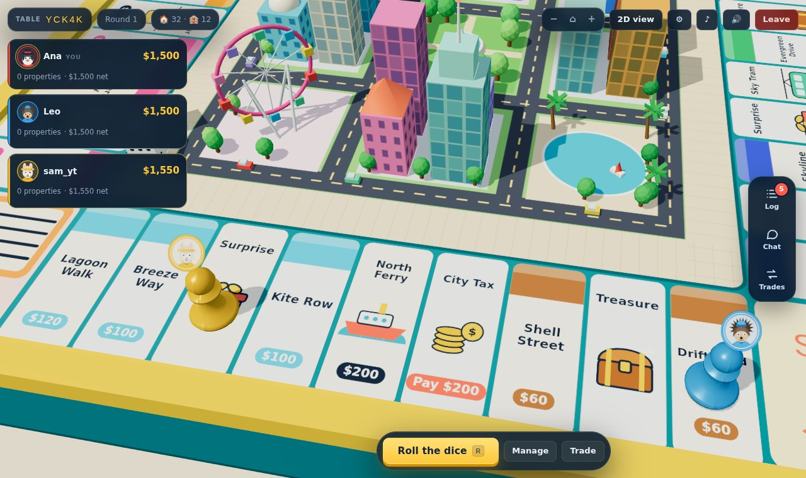
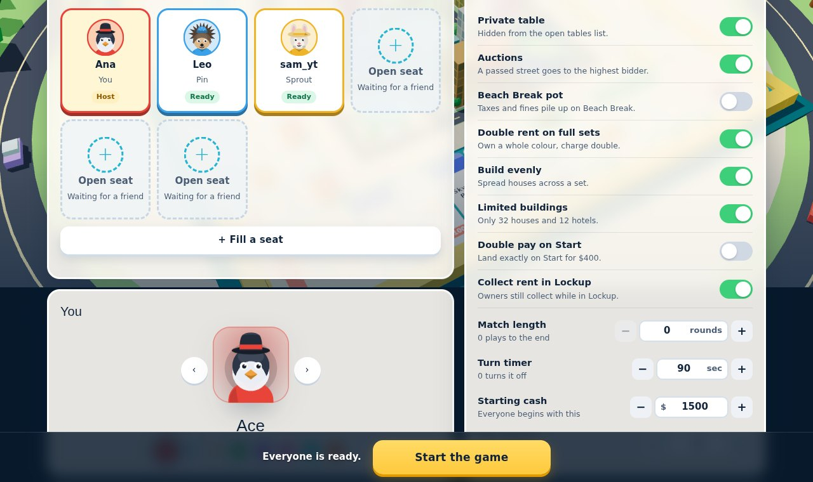
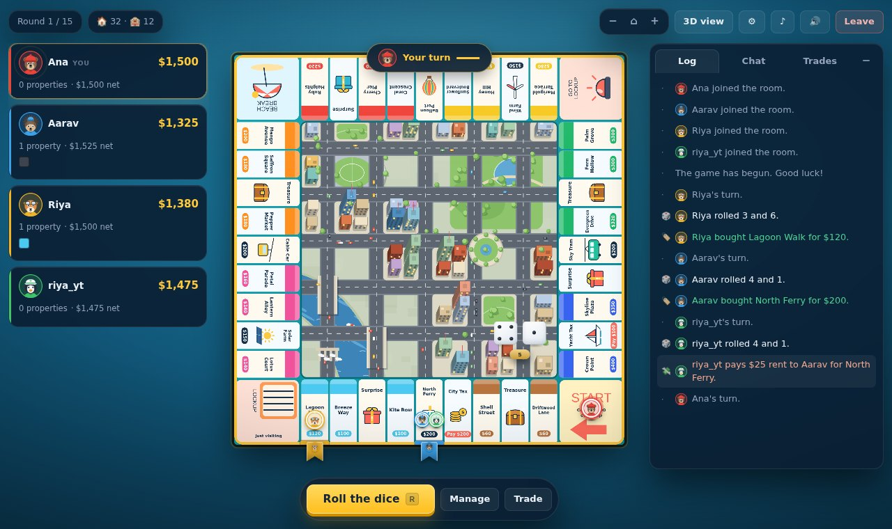
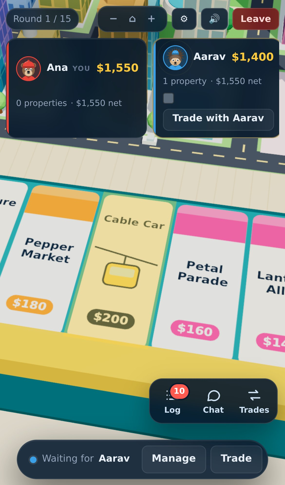

<div align="center">

# Rent Rush

**Buy streets. Build houses. Collect the rent.**

A free multiplayer property-trading board game that runs in your browser — in 3D,
with voice chat, and no download.

### ▶ Play it: **[rentrush.in](https://rentrush.in/)**



</div>

---

## What it is

Press **Play** and you are at a four-player table within seconds. Roll, buy
streets, build houses, charge rent, make deals — the last one standing (or the
richest when the round limit runs out) wins. Or make a **private table**, share
the code, and play with friends over **voice chat**.

Everything you see is generated in code: the board face, the island and its
town, the pawns, dice, characters, sounds and music. There are no binary art or
audio files in the game itself — see [`ASSETS.md`](ASSETS.md).

## Screenshots

**At the table, in 3D.** The camera flies to whoever is rolling, the dice tumble
onto the promenade, and pawns walk tile by tile.



**Play with friends.** A big table code, seats that fill as friends arrive,
house rules you can change, and a microphone on each seat once the call starts.



**Or the 2D board**, for slower devices — same game, same table, lighter to draw.
The Log / Chat / Trades panel sits on the right.



<div align="center">
<strong>On a phone</strong>, with the panel tucked into a dock above the action bar.<br><br>

</div>

## What's in it

| | |
| --- | --- |
| **Quick match** | Four players, about ten minutes, starts in seconds. Empty seats fill so nobody waits. |
| **Private tables** | A five-letter code or an invite link, up to six seats, house rules the host sets. |
| **3D or 2D** | A full 3D island, or a flat board on weaker devices. Switch any time in Settings. |
| **Voice chat** | At friends' tables: everyone joins as they sit down, mute is one click, the host can silence anyone. |
| **Chat and typing** | Text chat at every table, with "Ana is typing…" as it happens. |
| **Trading** | Offer streets, cash and jail cards; the board highlights what is on the table. |
| **Auctions** | A street somebody passes on goes to the highest bidder. |
| **Accounts** | Play as a guest, or sign up to keep your level, coins and leaderboard place. |
| **Notifications** | Tells you it is your turn, or that someone wrote, while the game is in another tab. |
| **Announcements** | Purchases, jail, bankruptcies and deals pop up for everyone at the table. |

## How a match goes

1. **Home.** Pick a nickname, a character and a colour.
2. **Play.** A guest account is made on the spot, so XP and coins count from the
   first match. Or sign up at any time and keep what you earned.
3. **Matchmaking.** You are seated at the next table that is filling up.
4. **Match.** Four players, 45-second turns, 15 rounds. Roll, buy, build,
   mortgage, trade, bankrupt your rivals.
5. **Results.** Podium, XP and coins earned, level bar, and **Play again**.

## Running it yourself

Needs **Node 22.13 or newer** (the server uses Node's built-in SQLite).

```bash
npm install
npm run dev          # game server on :3001, client on :5173
```

Open http://localhost:5173 and press **Play**.

Production build:

```bash
npm run build        # typecheck + bundle into dist/
npm start            # serves dist/, the API and the socket server on :3001
```

Or with Docker:

```bash
docker compose up --build        # http://localhost:3001, data kept in a volume
```

### Settings

Copy `.env.example` to `.env`. The ones that matter:

| Variable | What it does |
| --- | --- |
| `PORT` | Port to listen on (default 3001). |
| `DATA_DIR` / `DB_FILE` | Where the SQLite database lives. Put it on a persistent disk. |
| `ALLOWED_ORIGINS` | Comma-separated origins allowed to open a socket. |
| `TRUST_PROXY` | Set behind a load balancer so rate limits see real client IPs. |
| `COOKIE_SECURE` | Session cookies are HTTPS-only in production; `0` turns that off locally. |
| `LIVEKIT_URL`, `LIVEKIT_API_KEY`, `LIVEKIT_API_SECRET` | Voice chat. Leave unset and the feature simply doesn't appear. |

The server prints `voice chat is on (…)` or `voice chat is off — set …` when it
starts, so you can see at a glance which you have.

## Going live

[rentrush.in](https://rentrush.in/) runs on a single small VM: Docker, with
[Caddy](https://caddyserver.com) in front for HTTPS.

1. Point the domain's `A` record at the server's static IP (no `AAAA` record).
2. Open ports 80 and 443.
3. On the server:

   ```bash
   git clone https://github.com/MayankJha0333/monopoly.git rentrush
   cd rentrush
   bash deploy/setup.sh          # swap, Docker, build, start
   ```

   For another domain: `DOMAIN=play.example.com bash deploy/setup.sh`.

### Automatic deploys

`.github/workflows/deploy.yml` runs on every push:

1. **Rules, accounts and sockets** — typecheck, build, rule tests, account
   tests, a simulated season and the socket end-to-end test.
2. **Browser tests** — the Playwright suite.
3. **Deploy** (pushes to `main` only, after both pass) — connects to the server
   over SSH, moves it to that commit, and checks the live site answers. The old
   version keeps serving until the new one has built.

Repository secrets: `VM_HOST`, `VM_USER`, `VM_SSH_KEY`. To roll back, re-run an
older green run, or on the server: `bash deploy/update.sh <commit>`.

## Tests

```bash
npm test             # everything: rules, accounts, simulation, sockets, browser

npm run test:rules   # rent, building, mortgages, trades
npm run test:auth    # password hashing, guest upgrade, sessions, round cap
npm run sim 150      # filler-only games, checking engine invariants every step
npm run e2e          # real sockets: private tables, quick play, chat, voice passes
npm run test:ui      # Playwright: menus, matchmaking, turns, trading, phone layout
npm run smoke        # Playwright: writes screenshots of every screen to shots/
```

Browser tests use your installed Chrome. Set `PW_CHROMIUM=/path/to/chromium` to
use another build.

## How it fits together

| Path | What lives there |
| --- | --- |
| `shared/` | Board data, cards, types, rule helpers and the level curve — used by both sides. |
| `server/engine.ts` | The authoritative game: rules, turn phases, money, round limit, standings. |
| `server/rooms.ts` | Tables, quick-play seating, seat fillers, reconnects, rewards. |
| `server/bot.ts` | Decisions for filled seats and for players who leave mid-match. |
| `server/auth.ts` | Accounts, password hashing, sessions, profile and leaderboard API. |
| `server/voice.ts` | LiveKit passes for a table's call, and the host's mute. |
| `server/index.ts` | HTTP + Socket.IO wiring, security headers, static hosting, shutdown. |
| `client/src/board3d/` | The 3D board: island, town, pawns, houses, dice and camera. |
| `client/src/board/` | The 2D board, for devices without WebGL or when chosen in Settings. |
| `client/src/ui/` | Home, lobby, matchmaking, the table HUD, panels and dialogs. |
| `client/src/voice/` | The call itself, kept outside React so a redraw never cuts the sound. |
| `deploy/` | Caddy config and the server setup / update scripts. |

The server is authoritative: clients send intents (`game:roll`, `trade:offer`)
and get the whole state back. Seat fillers are marked only on the server; the
state sent to players never says which seats they are.

## Under the hood

- **Board face, island and town** are drawn in code onto a canvas and into
  three.js geometry — `client/src/lib/boardTexture.ts` and `cityPlan.ts`.
- **Music** is played live with the Web Audio API: pad, bass, off-beat ukulele
  and a steel-drum melody re-invented every loop (`client/src/audio/music.ts`).
  It stops whenever the game is not the window you are using.
- **Pace** is deliberately relaxed: pawns walk about four tiles a second, dice
  hang for a moment after landing, cards stay up long enough to read.
- **Security**: scrypt password hashing, `httpOnly` session cookies (only a hash
  of the token is stored), per-IP rate limits, per-socket payload validation,
  CSP and HSTS in production.

## Known limits

- Live tables are kept in memory; a restart ends games in progress (accounts and
  stats are safe in SQLite).
- One instance holds all tables, so scaling out needs sticky sessions and a
  shared room store first.
- Bankrupting to the bank returns property unowned rather than auctioning it.
- Email is collected but not verified, and there is no password reset yet.
